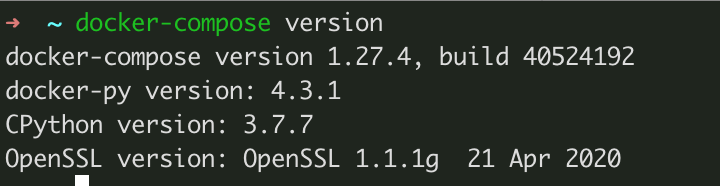
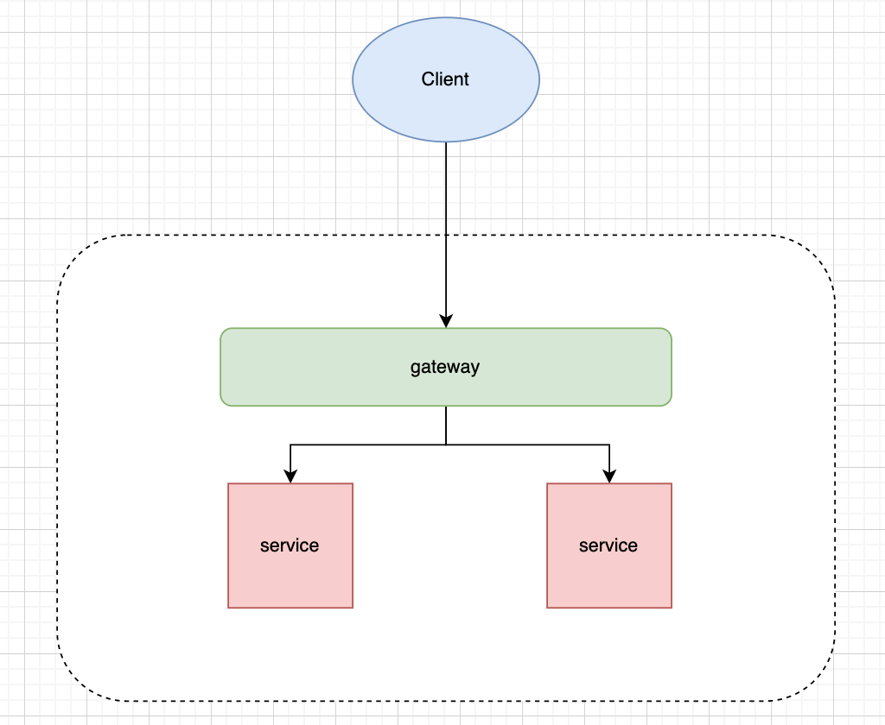
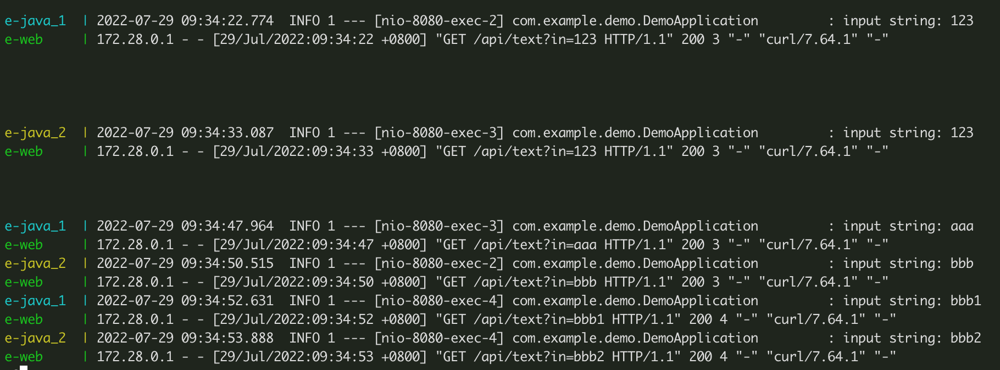

# 20220804-DockerCompose部署和编排服务

# Docker Compose

# 概念

`Docker Compose` 是运行和管理多个 docker 容器的工具。

`Docker Compose` 是 Docker 官方编排（Orchestration）项目之一，负责快速的部署分布式应用。

# 安装

[https://github.com/docker/compose/releases](https://github.com/docker/compose/releases)

## Linux

```bash
# v2.7.0
$ sudo curl -L "https://github.com/docker/compose/releases/download/v2.7.0/docker-compose-$(uname -s)-$(uname -m)" -o /usr/local/bin/docker-compose
```

```bash
$ curl -L https://get.daocloud.io/docker/compose/releases/download/v2.7.0/docker-compose-`uname -s`-`uname -m` > /usr/local/bin/docker-compose
```

- 如果是 ARM 架构，使用 pip 进行安装

    ```bash
    $ sudo pip install -U docker-compose
    ```


创建软连接

```bash
$ sudo chmod +x /usr/local/bin/docker-compose
$ sudo ln -s /usr/local/bin/docker-compose /usr/bin/docker-compose

```

查看是否成功

```bash
$ docker-compose version
```


docker compose version

## MacOS

brew 安装

```bash
$ brew install --cask --appdir=/Applications docker
```

安装包安装

[https://docs.docker.com/desktop/install/mac-install/](https://docs.docker.com/desktop/install/mac-install/)

## Win 安装

[https://hub.docker.com/editions/community/docker-ce-desktop-windows](https://hub.docker.com/editions/community/docker-ce-desktop-windows)

# 常用命令

命令格式

```bash
docker-compose [-f=<arg>...] [options] [COMMAND] [ARGS...]
```

- `-f/--file` 指定使用的 Compose 模板文件，默认为 `docker-compose.yml` 或 `docker-compose.yaml`
- `-p, --project-name NAME` 指定项目名称，默认将使用所在目录名称作为项目名
- `--verbose` 输出更多调试信息
- `-v/--version` 输出版本信息

### ps

列出当前项目中所有正在运行的容器

`docker-compose ps -a`  列出当前项目中所有(运行和停止)的容器

### up

在当前会话，构建镜像（如果配置发生改变，则重新构建）、创建服务、启动服务、关联容器。

如果按了 `Ctrl + C` ，则服务全部停止。所以部署服务时候，用下面命令：

`docker-compose up -d` 在后台执行上述操作

### down

停止当前项目下所有服务

### logs

打印日志

### exec

进入指定的容器

### scale

指定服务运行的容器个数，e.g.

```bash
$ docker-compose scale mysql=2 java=4 nginx=3
```

### start

启动指定的容器

### stop

停止指定的容器

### restart

重启指定的容器

### top

查看服务容器的进程信息

### rm

删除指定的停止状态的容器，加 `-f` 强制删除，可以删除运行的容器

### pull

拉取服务依赖的 docker 镜像

### push

推送服务依赖的 docker 镜像到指定仓库

### build

构建镜像，构建的镜像名称格式为 `项目名称_服务名称` ，e.g.

```bash
jxpt_nginx
```

### config

验证 compose 文件格式是否正确

## 部署一个 ReactApp 服务

### 准备构建物

```bash
$ create-react-app g-web
$ npm run build
```

然后打开 index.html 验证

### 准备部署的配置文件

```bash
$ touch docker-compose.yml
$ vim docker-compose.yml
---
version: '3'

services:
  e-web:
    image: nginx:1.16.0
    hostname: e-web
    container_name: e-web
    restart: always
    ports:
      - "8090:80"
    env_file:
      - ./.env
    volumes:
      - ./build:/usr/local/share/html
      - ./conf.d:/etc/nginx/conf.d
```

编辑 .env

```bash
$ touch .env
$ vim .env
---
TZ=Asia/Shanghai
```

编辑 e-web.conf

```bash
$ touch conf.d/e-web.conf
$ vim conf.d/e-web.conf
---
server {
  listen 80;
  server_name e-web;

  location / {
		root /usr/local/share/html;
		index index.html;
  }
}
```

### 开始部署

```bash
$ docker-compose up -d
```

访问 http://localhost:8090


## 部署一个 Java 应用

### 准备构建物

初始化工程

[https://start.spring.io/](https://start.spring.io/)

写一个接口

```java
package com.example.demo;

import org.springframework.boot.SpringApplication;
import org.springframework.boot.autoconfigure.SpringBootApplication;
import org.springframework.web.bind.annotation.GetMapping;
import org.springframework.web.bind.annotation.RestController;

import java.util.HashMap;
import java.util.Map;

@SpringBootApplication
@RestController
public class DemoApplication {

	public static void main(String[] args) {
		SpringApplication.run(DemoApplication.class, args);
	}

	@GetMapping("/userinfo")
	public Map<String, Object> userinfo() {

		Map<String, Object> userinfo = new HashMap<>();
		userinfo.put("id", 1);
		userinfo.put("name", "zhangsan");
		userinfo.put("age", 88);
		return userinfo;
	}
}
```

启动服务，验证是否正确

```bash
$ mvn spring-boot:run

$ curl -X GET http://localhost:8080/userinfo
```

打jar包，准备部署到 docker 容器中

```bash
$ mvn package

$ ll target
total 34432
drwxr-xr-x  5 yangzhenlong  staff   160B  7 27 18:48 classes
-rw-r--r--  1 yangzhenlong  staff    17M  7 27 18:53 e-java-0.0.1-SNAPSHOT.jar
-rw-r--r--  1 yangzhenlong  staff   3.0K  7 27 18:53 e-java-0.0.1-SNAPSHOT.jar.original
drwxr-xr-x  3 yangzhenlong  staff    96B  7 27 18:48 generated-sources
drwxr-xr-x  3 yangzhenlong  staff    96B  7 27 18:48 generated-test-sources
drwxr-xr-x  3 yangzhenlong  staff    96B  7 27 18:53 maven-archiver
drwxr-xr-x  3 yangzhenlong  staff    96B  7 27 18:48 maven-status
drwxr-xr-x  2 yangzhenlong  staff    64B  7 27 18:53 surefire
drwxr-xr-x  3 yangzhenlong  staff    96B  7 27 18:48 test-classes
```

### 准备配置文件

```bash
$ touch docker-compose.yml
$ vim docker-compose.yml
---
version: '3'

services:
  e-java:
    image: openjdk:8
    hostname: e-java
    container_name: e-java
    restart: on-failure
    ports:
      - "8080:8080"
    environment:
      TZ: Asia/Shanghai
    volumes:
      - ./target/e-java-0.0.1-SNAPSHOT.jar:/app.jar
    command: "java -jar /app.jar --spring.profiles.active=prod"
```

### 执行部署

```bash
$ docker-compose up -d
```

查看运行容器和验证接口

```bash
$ docker-compose ps

$ docker-compose logs -f

$ curl http://localhost:8080/userinfo
```

## 编排服务

### 服务编排图示



新增接口 `/text` 打印输入参数的内容

```bash
import org.slf4j.Logger;
import org.slf4j.LoggerFactory;

private static final Logger log = LoggerFactory.getLogger(EJavaApplication.class);

@GetMapping("/text")
public String text(String in) {
	log.info("input string: {}", in);
	return in;
}
```

启动服务测试

```bash
$ mvn spring-boot:run
$ curl http://localhost:8080/text?in=hello
---
hello
```

### 准备部署的配置文件

```bash
$ mkdir compose-example
$ cd compose-example
# 复制jar包
$ cp e-java/target/e-java-0.0.1-SNAPSHOT.jar ./
# 复制 react 构建物
$ cp -r e-web/build ./
$ touch docker-compose.yml
$ vim docker-compose.yml
---
services:
  e-java:
    image: openjdk:8
    hostname: e-java
    #container_name: e-java
    restart: on-failure
    ports:
      - "8080"
    deploy:
      replicas: 2
    environment:
      TZ: Asia/Shanghai
    volumes:
      - ./e-java-0.0.1-SNAPSHOT.jar:/app.jar
    command: "java -jar /app.jar --spring.profiles.active=prod"
    networks:
      - glodon
  e-web:
    image: nginx:1.16.0
    hostname: e-web
    container_name: e-web
    restart: always
    ports:
      - "8090:80"
    env_file:
      - ./.env
    volumes:
      - ./build:/usr/local/share/html
      - ./conf.d:/etc/nginx/conf.d
    networks:
      - glodon
networks:
  glodon:
```

添加后端服务的代理配置

```bash
$ mkdir conf.d
$ touch conf.d/e-web.conf
$ vim conf.d/e-web.conf
---
server {
  listen 80;
  server_name e-web;

  location / {
		root /usr/local/share/html;
		index index.html;
  }

  location /api/ {
  	proxy_pass http://e-java:8080/;
  }
}
```

### 执行部署并查看日志

```bash
$ docker-compose up -d
$ docker-compose logs -f
```

访问接口

```bash
$ curl http://localhost:8090/api/text?in=123
$ curl http://localhost:8090/api/text?in=123
$ curl http://localhost:8090/api/text?in=aaa
$ curl http://localhost:8090/api/text?in=bbb
$ curl http://localhost:8090/api/text?in=bbb1
$ curl http://localhost:8090/api/text?in=bbb2
```

再查看日志



### 服务动态伸缩

搭建监控服务，根据资源情况或者并发量，定义规则，来动态 scale

```bash
#!/bin/sh
while [ 1 ]
do
    # 从监控服务获取 cpu 占有率
		cpu_rate=`curl http://localhost:8080/metrics/cpu_rate`
		# 如果超过 60%，自动增加一个 java 服务
		if [$cpu_rate gt 60]; then
			current_scale_num=`docker-compose ps e-java | grep e-java | wc -l`
			docker-compose scale e-java=($current_scale_num+1)
		fi;
    sleep 5m
done;
```

kubernetes 自动伸缩

[https://kubernetes.io/zh-cn/docs/tasks/run-application/horizontal-pod-autoscale/](https://kubernetes.io/zh-cn/docs/tasks/run-application/horizontal-pod-autoscale/)