# 20220401-windows平台shell 工具

## 下载 windows shell

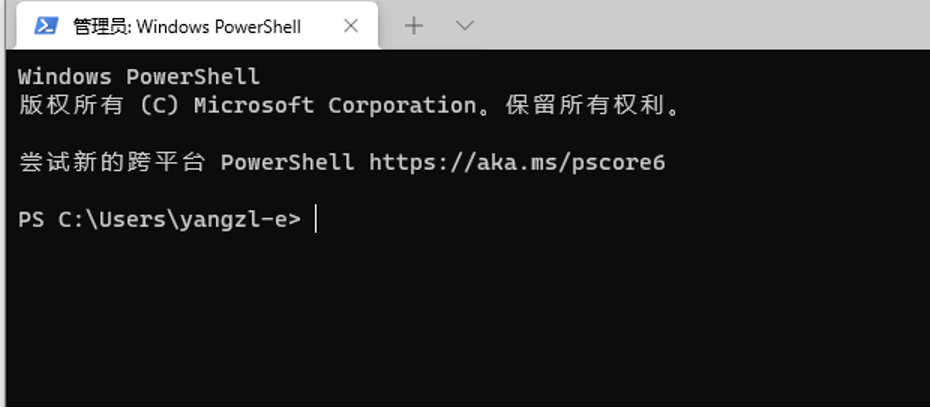

## 配置 shell 为 git bash

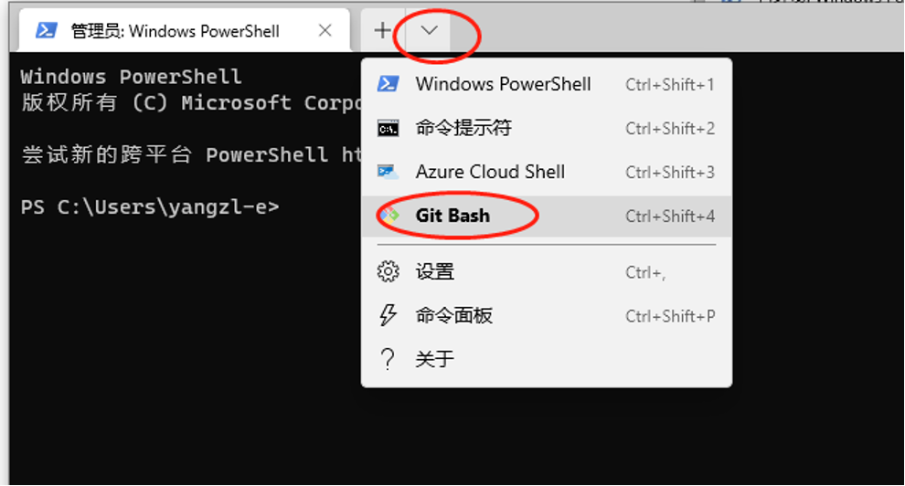

配置后的界面如下


比如切换目录到 D 盘，输入

```bash
$ cd /d
```

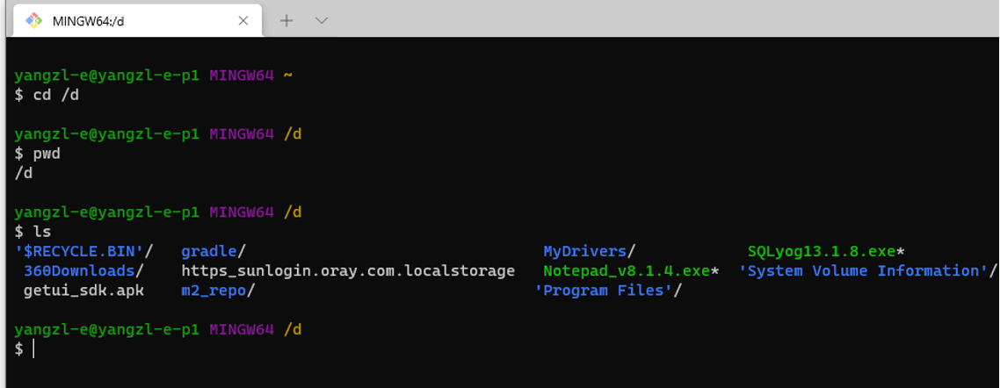

## IDE 工具支持 git bash

以 Intellij Idea 为例

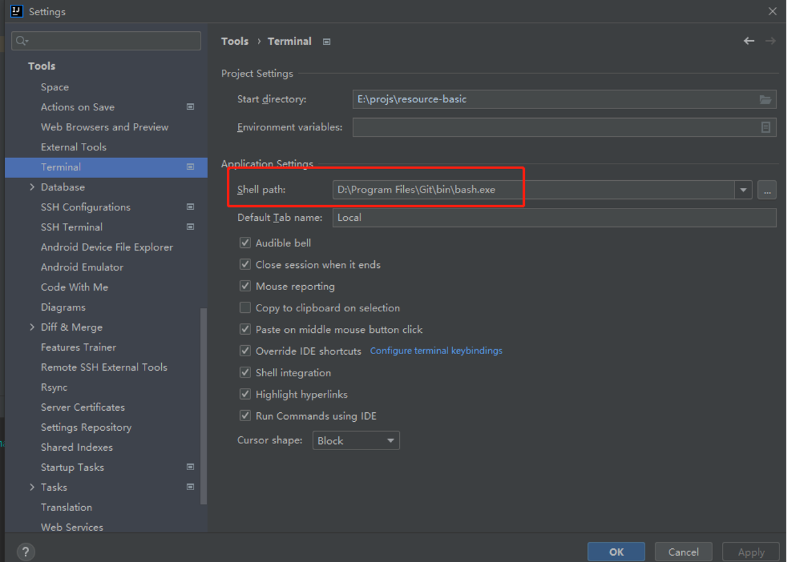

效果是这样的

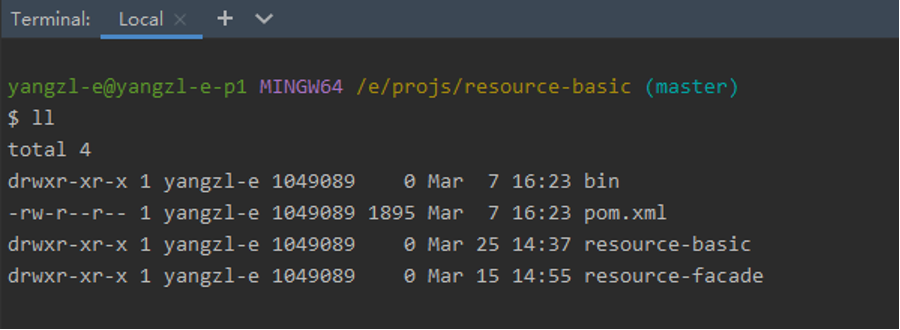

## 常用工具

### Git 自定义

```bash
$ vim D:\Program Files\Git\etc\gitconfig

[alias]
  co = checkout
  cm = commit
  br = branch
  st = status
  lg = log --color --graph --pretty=format:'%Cred%h%Creset -%C(yellow)%d%Creset %s %Cgreen(%cr) %C(bold blue)<%an>%Creset' --abbrev-commit
```

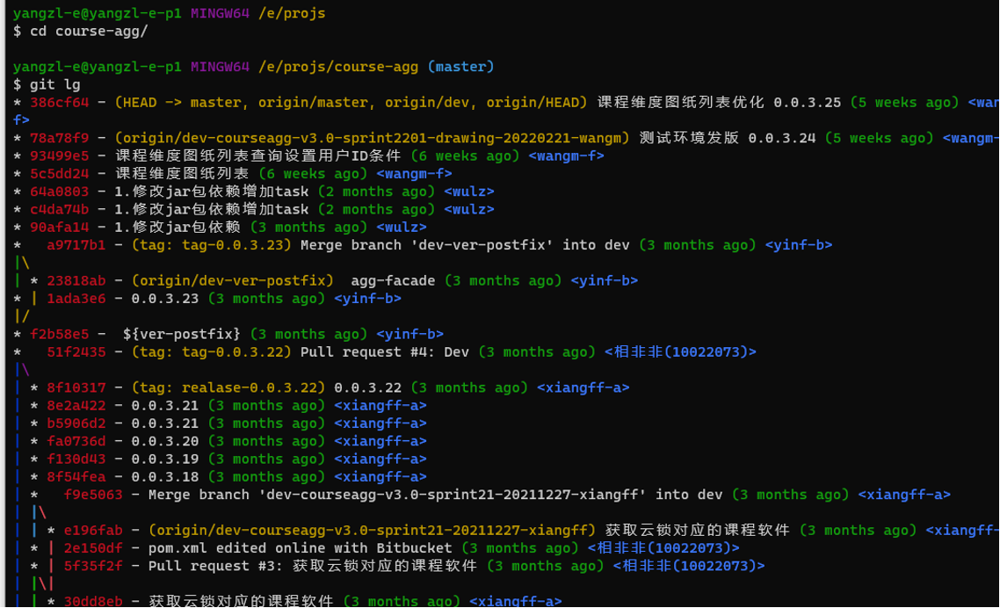

### git-flow

### SSH

### SSH 登录

使用用户名密码登录到服务器

```bash
$ ssh root@192.168.0.1 
xxx's password: <密码>
```

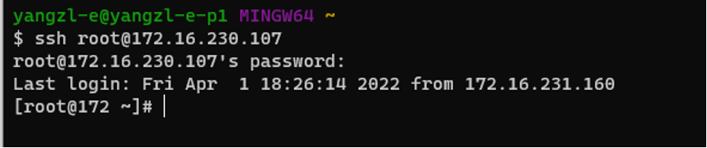

使用公钥登录到服务器

- 生成 rsa 公私钥

```bash
$ ssh-keygen [-t rsa] 
```

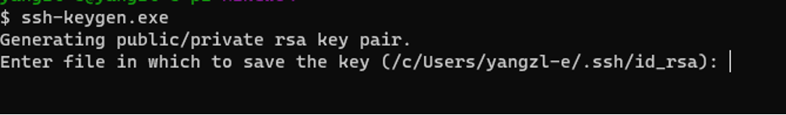

- 将公钥拷贝到服务器

```bash
$ ssh-copy-id root@192.168.0.1 

xxx's password: <密码>
```

**|** 或者手动复制公钥后，拷贝到服务器 /{user_home}/.ssh/authorized_keys 文件

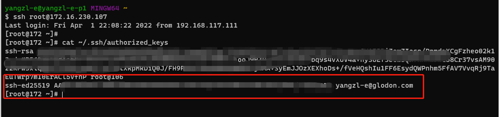

- 公钥免密登录

```bash
$ ssh root@192.168.0.1
```

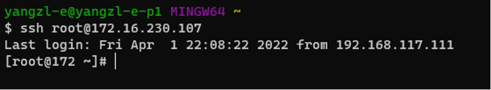

### SSH 设置别名和免密登录

**|** 类似设置 hosts，但不用于 hosts

**|** git bash 的 hosts 文件位置在 /d/Program\ Files/Git/etc/hosts

```bash
$ vim /d/Program\ Files/Git/etc/ssh/ssh_config

Host 107  # 别名
HostName 172.16.230.107 # 服务器IP
User root  # 服务器登录用户名
```

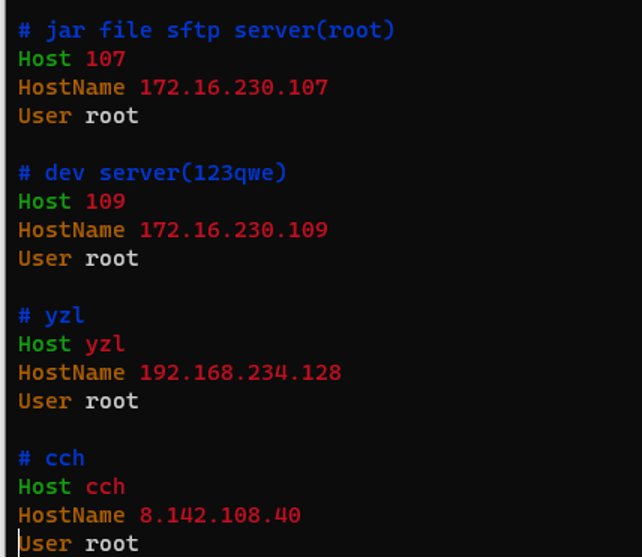

然后使用别名，配合公钥免密登录

```bash
$ ssh <ssh_config_alias_name>
```

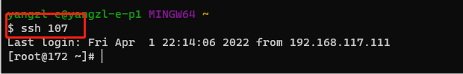

### SSH 通道

**|** 通过 ssh 建立一条通信隧道，使得本地和服务器的端口能够互相映射。类似于 nginx 代理

- 本地端口转发到服务器

```bash
# 本地端口 18868 转发到 172.16.230.107:8868 
$ ssh -L 18886:172.16.230.107:8886 root@172.16.230.107
```
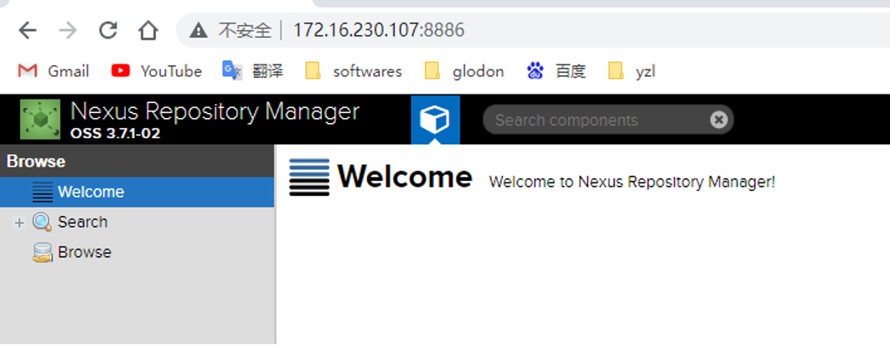

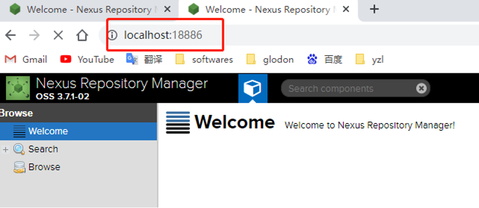

- 服务器端口转发到本地

```bash
$ ssh -R 18641:localhost:8641 root@192.168.234.128
```


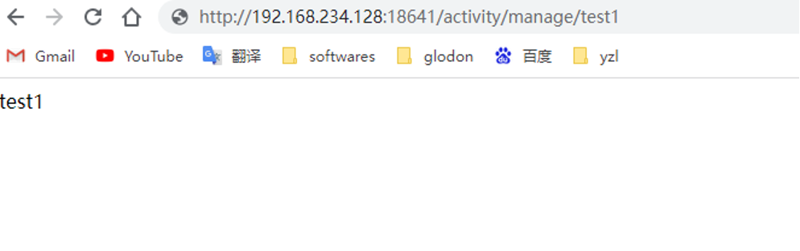

### scp 远程复制

### curl

### sed

### wget

### lsof

### md5

```bash
$ md5sum a.txt 
$ echo '123456' | md5sum | awk '{print $1}'
```

Bash

### 其他不支持的命令

去这个网站下载：[https://sourceforge.net/projects/gnuwin32/files/](https://sourceforge.net/projects/gnuwin32/files/)

然后复制到 D:\Program Files\Git\usr\bin 目录下